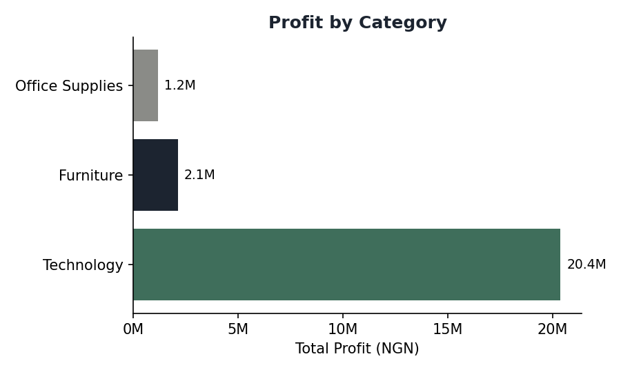
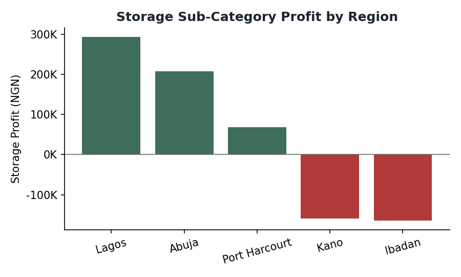

[README.md](https://github.com/user-attachments/files/32588558/README.md)
# Regional Sales & Profit Analysis (Nigeria)

**Author:** Umar Muhammad
**Tools:** Microsoft Excel (Pivot Tables), data cleaning
**Dataset:** 400 simulated orders across 5 Nigerian regions (Lagos, Abuja, Port Harcourt, Kano, Ibadan), 3 product categories, and 3 customer segments. Built for practice — figures are fictional but modeled on realistic retail patterns.

## Question

Which product category and region drive the most profit, and where is the business losing money?

## Method

1. Built a pivot table: **Category × Region**, summed on Profit, to find the overall profit picture.
2. Drilled into **Sub-Category** within the weakest category (Furniture) to isolate where losses were concentrated.
3. Filtered raw order-level data for the loss-making sub-category/region combinations and checked the **Discount** field as a possible explanation.

## Findings

**1. Technology drives the overwhelming majority of profit.**

| Category | Total Profit (NGN) | % of Total |
|---|---|---|
| Technology | 20,360,314 | 86.1% |
| Furniture | 2,121,152 | 9.0% |
| Office Supplies | 1,169,693 | 4.9% |

**2. Within Furniture, the Storage sub-category loses money — but only in two regions.**

Storage is profitable in Lagos (+₦293,883) and Abuja (+₦207,951), marginal in Port Harcourt (+₦67,925), but **loses money in Kano (-₦159,401) and Ibadan (-₦164,417)** — despite Kano being the single strongest region overall for total profit.

**3. The loss is not explained by discounting.**

A natural hypothesis is that heavier discounting in Kano/Ibadan explains the losses. Checking order-level data shows this isn't the case — several **zero-discount** orders in those regions post large losses (e.g. -₦120,848, -₦82,576), while some **20%-discount** orders remain profitable. This rules out pricing/discount strategy as the cause and points instead to a cost factor not captured in this dataset — most likely regional handling, damage, or logistics costs specific to Storage products.

## Recommendation

Rather than adjusting Storage pricing or discount policy company-wide, investigate **regional handling/logistics costs for Storage products in Kano and Ibadan specifically** — the loss pattern is localized, not a pricing problem.

## Files

- `sales_practice_dataset.csv` — the raw dataset
- `charts_profit_by_category.png`, `charts_storage_by_region.png` — supporting charts
- Full portfolio write-up: see [umarfarouqmk's portfolio](https://claude.ai/artifact/7yJZy2PyQdiPEy1Uorufe3)
